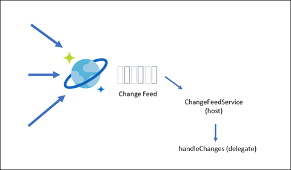

# Azure Cosmos DB change feed

## What is the change feed?

The change feed is a feature of Azure Cosmos DB that keeps track of changes to documents in a monitored container in the order they were processed. It's included in the Azure Cosmos DB SDK V4.

Some potential uses for the change feed include:

- Audit trail: tracking changes as they happen and preserving the order they happened

- Real time data processing: such as working with data from sensors, devices, applications, and other technologies that are reporting data on a large scale or working with the data in materialized views

- Event sourcing: as an append-only data source, the Azure Cosmos DB change feed works well as a source in an [event sourcing pattern](https://docs.microsoft.com/azure/architecture/patterns/event-sourcing).

- Data synchronization: such as synchronizing data with a data store, such as a data warehouse or data lake

## Who is using the change feed?

Here are a few customer stories using the Azure Cosmos DB change feed:

- [Sandvik Coromant](https://customers.microsoft.com/story/810496-sandvik-coromant-chemicals-power-bi) leverages the change feed to be more reactive to events.

- [SitePro](https://customers.microsoft.com/story/1366128637262632842-sitepro-accelerates-green-expansion-using-azure-cache-for-redis) uses the change feed as a decision audit trail.

- [ASOS](https://customers.microsoft.com/story/asos-retail-and-consumer-goods-azure) uses the change feed as part of their order workflow, working with event-driven microservices.

## Key components for processing the change feed

There are some key components to know about in change feed processing:

- Monitored container

- Lease container

- Host

- Delegate

The **monitored container** is the container with the changes that are monitored. In our example, we'll monitor the pet-supplies collection in our pet-supplies database. The **lease container** is used for tracking the state of processing of the feed for each of the change feed consumers. This is another container that needs to be added to your Azure Cosmos DB database for it to work. The lease collection should be created with the Partition Key of /id. The **host** is what listens and reacts to changes from the feed. The **delegate** is what handles the business logic of the processing.

The host needs to acquire a **lease**, a document that is used to bookmark a host's progress in processing the feed. Suppose the change feed processor was stopped while there were changes made to the monitored container. When the change feed processor starts, it will grab its lease, pass the changes to the delegate, and then update its lease with a new continuation token, which is a bookmark of where it is in the feed.

### Create the lease container

To create the lease container, run the following command:

```azurecli
az cosmosdb sql container create -g pet-supplies-demo-rg --account-name
pet-supplies-demo --database-name pet-supplies --name lease
--partition-key-path "/id"
```

### Review the code

In our code, we have the following settings in **application-default.properties** for the change feed:

```json
azure.cosmos.feed-container=pet-supplies
azure.cosmos.lease-container=lease
```

We also updated the returned builder in the getCosmosClientBuilder() function in the CosmosConfiguration class to include the contentResponseOnWriteEnabled, as this is required for the change feed processor.

```java
@Bean
public CosmosClientBuilder getCosmosClientBuilder() {
   DirectConnectionConfig directConnectionConfig = new DirectConnectionConfig();
   GatewayConnectionConfig gatewayConnectionConfig = new GatewayConnectionConfig();
   return new CosmosClientBuilder()
      .endpoint(uri)
      .key(key)
      .contentResponseOnWriteEnabled(true)
      .directMode(directConnectionConfig, gatewayConnectionConfig);
}
```

## Delete strategy with the change feed

Inserts and updates appear in the change feed. However, if you delete an item from a collection that doesn't get captured by the change feed. The way to capture deletes is two-fold:

- Enable Time to Live on the collection. Time to Live enables you to set expiration times on documents. See this article on [configure time to live in Azure Cosmos DB](https://docs.microsoft.com/azure/cosmos-db/sql/how-to-time-to-live?tabs=dotnetv2%2Cjavav4).

- Use the ttl property of an item to mark it for deletion.

With regards to the ttl property:

- If the property is null or not present, the document won't expire.

- If the property is present and set to -1, the document won't expire.

- If the ttl is present on the document, then the document will expire in the ttl period, where the duration is expressed in the number of seconds after the last modified time.

## Consuming the change feed

There are a few ways to read the change feed that either deal with push models or pull models. Push models are the easiest way to get data from the change feed.

> If you need to control the feed consumption at a customized pace, you'll need to use the pull model. If that is the case, refer to this article on the [Change feed pull model in Azure Cosmos DB](https://docs.microsoft.com/azure/cosmos-db/sql/change-feed-pull-model).

There are two ways to get push notifications:

- Azure Functions

- Using the Change Feed Processor

Our code sample takes the approach of using the change feed processor, continuing with reactive programming.

### Azure Functions

Azure Functions is the simplest way to work with the change feed using the push model in a serverless event-based flow. They're connected to the change feed through an Azure Functions trigger for Cosmos DB. Learn more in this article [Create a function triggered by Azure Cosmos DB](https://docs.microsoft.com/azure/azure-functions/functions-create-cosmos-db-triggered-function).

### Use the Change Feed Processor

In order to use the Change Feed Processor in our application, we created the ChangeFeedService, which starts the change feed processor. As the service picks up changes from the change feed, it brings in the changes and passes them on to the handleChanges function.



We have a Change Feed controller so that we can access the output from the change feed via the API. The Change Feed controller gets the changes from the Change Feed service. The activity happens in the
ChangeFeedService.java file. This is using the Change Feed Processor from the Azure Cosmos DB SDK V4.

We have a ChangeFeedProcessorBuilder bean in CosmosConfiguration.java. This is where we set the database, monitored container (feedContainer), lease container (leaseContainer), as well as any options. The builder bean is set to emit the items through the for loop passed to handleChanges().

The Change Feed service handles the logic for processing change documents. In the init(), we build a change feed processor using the builder and passing it an updated change handler. We also set the changedProducts public property to subscribe to the output for the productSink. The logic for filtering our documents is handled in the handleChanges() function.

## Run the code and check it out

Our code is specifically monitoring product changes, though you can see this as a start for handling the change feed changes with your own logic. There's a link on the home page of the sample application to the Change Feed service. Open that link in another tab, and then run the Update Product query in the Postman collection. Once you run the Update Product query, you should see an entry on the Change Feed page in your browser. Try running the Update Product Price query in the Postman collection, which does a partial document update. Notice that partial updates do appear in the change feed.

## Learn more

- [Change feed design patterns in Azure Cosmos DB](https://docs.microsoft.com/azure/cosmos-db/sql/change-feed-design-patterns)

- [Azure Cosmos DB Workshop - Azure Cosmos DB Change Feed](https://cosmosdb.github.io/labs/dotnet/labs/08-change_feed_with_azure_functions.html#use-azure-cosmos-db-change-feed-to-write-data-to-eventhub-using-azure-functions)

[Next &#124; Azure Cosmos DB Trigger for Azure Functions in Java](change-feed-with-cosmos-db-trigger-function.md){: .btn .btn-primary .btn-lg }
