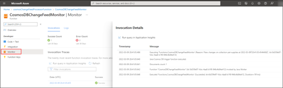

# Create an Azure Cosmos DB trigger for Azure Functions in Java

In the previous article, you used the change feed processor with reactive programming to monitor the change feed. As an alternative, you can also monitor the change feed by using an Azure Cosmos DB trigger for Azure Functions.

The following code sample, shows how to use an Azure Function App to listen to the change feed, and then send the changes to an event store.

## Set up the Azure Function App

To use Azure Functions, you need to create a storage account. As you create your storage account, ensure you stay within the following guidelines:

- Storage account names must be between 3 and 24 characters in length.

- Use numbers and lowercase letters only.

You can use the following command as a guide:

```azurecli
az storage account create --name petsuppliesstorage -g pet-supplies-demo-rg --location eastus --sku Standard_LRS
```

1. Store your Azure Storage connection string in this environment variable, as you might need it later:

   ```azurecli
   AZURE_WEBJOBS_STORAGE=$(az storage account show-connection-string --name petsuppliesstorage -g pet-supplies-demo-rg --query "connectionString" -o tsv)
   ```

1. Store your Azure Cosmos DB connection string in an environment variable:

   ```azurecli
   AZURE_COSMOS_CONNECTION_STRING=$(az cosmosdb keys list --type connection-strings --name pet-supplies-demo -g pet-supplies-demo-rg9 --query "connectionStrings[0].connectionString" -o tsv)
   ```

## Azure Function App code

Use Azure Functions with the Azure Cosmos DB trigger for another example of how to process the change feed. You can use a Maven archetype to scaffold Azure Functions. Because Java 11 functionality in Azure Functions is in preview, this section uses Java 8.

1. From an empty project folder, run the following Maven command:

   ```cmd
   mvn archetype:generate -DarchetypeGroupId="com.microsoft.azure" -DarchetypeArtifactId="azure-functions-archetype" -DadvancedOptions
   ```

   Use the following settings:

   - groupId: com
   - artifactId: function
   - package: com.function

1. When you're prompted, input *N* to trigger the advanced options prompts. The additional settings include:

   - appName: cosmosChangeFeedProcessorFunction
   - appRegion: \<Your region>
   - resourceGroup: pet-supplies-demo-rg
   - trigger: CosmosDBTrigger

   The Maven archetype generates boilerplate scaffolding. 

1. In *Function.java*, populate the following values:

   - databaseName: pet-supplies
   - collectionName: pet-supplies
   - leaseCollectionName: lease
   - connectionStringSetting: \<AzureCosmosDBConnectionString>

     \<AzureCosmosDBConnectionString> is the connection string setting value, which you can store in *local.settings.json*.

1. Update the `@FunctionName` annotation to have a more meaningful name such as CosmosDBChangeFeedMonitor.

1. The archetype also creates a file named *local.settings.json* at the same level as the *host.json* file. Update this file with the following settings:

   ```json
   {
      "IsEncrypted": false,
      "Values": {
         "AzureWebJobsStorage": "paste the value from AZURE_WEBJOBS_STORAGE",
         "AzureCosmosDBConnectionString": "paste the value from AZURE_COSMOS_CONNECTION_STRING",
         "FUNCTIONS_WORKER_RUNTIME": "java"
      }
   }
   ```

1. Run this function locally with the following commands:

   ```cmd
   mvn clean package
   func start host
   ```

## Deploy the function to Azure

Use the [Maven Plugin for Azure Functions](https://github.com/microsoft/azure-maven-plugins/wiki/Azure-Functions) to deploy your function to Azure.

1. Store your connection information in app settings variables in your Azure App Service resource.

1. In the *pom.xml* file, in the section for the Azure Functions Maven Plugin, add the following properties to the **appSettings** section:

   ```xml
   <property>
      <name>AzureWebJobsStorage</name>
      <value>${AZURE_WEBJOBS_STORAGE}</value>
   </property>
   <property>
      <name><AzureCosmosDBConnectionString></name>
      <value>${AZURE_COSMOS_CONNECTION_STRING}</value>
   </property>
   ```

   The `@CosmosDBTrigger` annotation's connectionStringSetting property looks for the \<AzureCosmosDBConnectionString> application setting.

1. To deploy the code to Azure, run:

   ```cmd
   mvn azure-functions:deploy
   ```

   The plugin creates the following items:

   - App Service plan
   - Application Insights component
   - Azure Function App with the Java runtime

1. After the code is successfully deployed, confirm your app settings were passed properly by using the following commands:

   ```azurecli
   az functionapp config appsettings list -g pet-supplies-demo-rg --name cosmosChangeFeedProcessorFunction --query "[? name=='AzureCosmosDBConnectionString']"

   az functionapp config appsettings list -g pet-supplies-demo-rg --name cosmosChangeFeedProcessorFunction --query "[? name=='AzureWebJobsStorage']"
   ```

1. You can also view these values in the Azure portal.

   

   If you make changes to your Contoso Pet Supplies data, it should trigger your Azure Function to use those changes. There's a lag time between the action and when it appears in the logs.

1. In the Azure portal, navigate to the function on the Function App resource and select **Monitor**.

   The function app that was invoked for your changes appears.

1. If you select timestamp, a panel with invocation details appears.

   

[Next &#124; Event sourcing](event-sourcing.md){: .btn .btn-primary .btn-lg }
