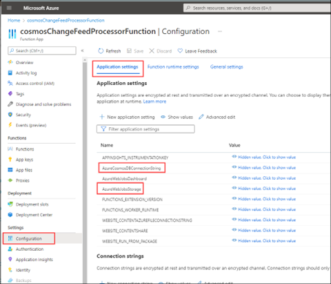

# Azure Cosmos DB Trigger for Azure Functions in Java

Another approach to monitoring the change feed is using an Azure Cosmos DB Trigger for Azure Functions.

In our code sample, we use an Azure Function App to listen to the change feed and pass the changes along to an event store.

## Set up the Azure Function App

In order to use Azure Functions, we need to create a storage account. When you create a storage account, you need to make sure you stay within the following guidelines:

- Storage account names must be between 3 and 24 characters in length.

- Use numbers and lower-case letters only.

Use the following command as a guide:

```azurecli
az storage account create --name petsuppliesstorage -g pet-supplies-demo-rg --location eastus --sku Standard_LRS
```

Store the Azure Storage connection string in this environment variable, as we may need it later:

```azurecli
AZURE_WEBJOBS_STORAGE=$(az storage account show-connection-string --name petsuppliesstorage -g pet-supplies-demo-rg --query "connectionString" -o tsv)
```

Store your Azure Cosmos DB connection string in an environment variable as well:

```azurecli
AZURE_COSMOS_CONNECTION_STRING=$(az cosmosdb keys list --type connection-strings --name pet-supplies-demo -g pet-supplies-demo-rg9 --query "connectionStrings[0].connectionString" -o tsv)
```

## Azure Function App code

We'll use Azure Functions with the Azure Cosmos DB Trigger as another example of processing the change feed.

There's a Maven archetype we can use for scaffolding Azure Functions. From an empty project folder, run the following Maven command:

```cmd
mvn archetype:generate -DarchetypeGroupId="com.microsoft.azure" -DarchetypeArtifactId="azure-functions-archetype" -DadvancedOptions
```

Use the following settings:

- groupId: com

- artifactId: function

- package: com.function

When prompted, input *N* so that you can trigger the advanced options prompts. The additional settings include:

- appName: cosmosChangeFeedProcessorFunction

- appRegion: \<Your region>

- resourceGroup: pet-supplies-demo-rg

- trigger: CosmosDBTrigger

> [!NOTE]
> Java 11 functionality in Azure Functions is in preview at the time of this writing, so we're using Java 8 for this particular section.

The Maven archetype will generate boilerplate scaffolding. In Function.java, populate the following values:

- databaseName: pet-supplies

- collectionName: pet-supplies

- leaseCollectionName: lease

- connectionStringSetting: "AzureCosmosDBConnectionString"

> [!NOTE]
> "AzureCosmosDBConnectionString" is the connection string setting value. You can store the connection string in **local.settings.json**.

Update the @FunctionName annotation to have a more meaningful name such as CosmosDBChangeFeedMonitor.

The archetype also created a file called **local.settings.json** at the same level as the **host.json** file. Update **local.settings.json** with the following settings:

```json
{
   "IsEncrypted": false,
   "Values": {
      "AzureWebJobsStorage": "paste the value from AZURE_WEBJOBS_STORAGE",
      "AzureCosmosDBConnectionString": "paste the value from AZURE_COSMOS_CONNECTION_STRING",
      "FUNCTIONS_WORKER_RUNTIME": "java"
   }
}
```

Run this function locally with the following commands:

```cmd
mvn clean package
func start host
```

## Deploy to Azure

We'll use [the Maven Plugin for Azure Functions](https://github.com/microsoft/azure-maven-plugins/wiki/Azure-Functions) to deploy our function to Azure.

We'll store our connection information in app settings variables on our Azure App Service resource.

In the **pom.xml** file, in the section for the Azure Functions Maven plugin, add the following properties to the \<appSettings> section:

```xml
<property>
   <name>AzureWebJobsStorage</name>
   <value>${AZURE_WEBJOBS_STORAGE}</value>
</property>
<property>
   <name>AzureCosmosDBConnectionString</name>
   <value>${AZURE_COSMOS_CONNECTION_STRING}</value>
</property>
```

> [!NOTE]
> The @CosmosDBTrigger annotation's connectionStringSetting property will look for the AzureCosmosDBConnectionString application setting.

To deploy the code to Azure, run:

```cmd
mvn azure-functions:deploy
```

This plugin will create:

- App Service plan

- Application Insights component

- Azure Function App with the Java runtime

Once the code is successfully deployed, you can confirm your app settings were passed properly by checking the following commands:

```azurecli
az functionapp config appsettings list -g pet-supplies-demo-rg --name cosmosChangeFeedProcessorFunction --query "[? name=='AzureCosmosDBConnectionString']"

az functionapp config appsettings list -g pet-supplies-demo-rg --name cosmosChangeFeedProcessorFunction --query "[? name=='AzureWebJobsStorage']"
```

You can also see these values in the Azure portal:



If you make changes to your Contoso Pet Supplies data, your Azure Function should be triggered to pick up those changes. There's some lag time between the action happening and it appearing in the logs.

In the Azure portal, navigate to the function itself on the Function App resource. Select **Monitor**. You should see the function app invoked for your changes. If you select the timestamp, a panel with invocation details will appear.


[Next &#124; Event sourcing](event-sourcing.md){: .btn .btn-primary .btn-lg }
