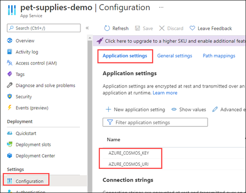

# Deploy to Azure App Service

[Azure App Service](https://docs.microsoft.com/azure/app-service/) is one of the ways to host Java applications in Azure. After your sample app is running locally, use the [Maven Plugin for Azure App Service](https://github.com/microsoft/azure-maven-plugins/blob/develop/azure-webapp-maven-plugin/) to deploy the sample app to Azure App Service. This tool creates the resources if they don't exist.

## Modify the pom.xml file

To deploy to Azure App Service, you don't need to install any separate components. The *pom.xml* file has a reference in the \<build> section for the `azure-webapp-maven-plugin` artifact.

In the *pom.xml* file, update the following properties in the \<properties> section:

- azure.webapp.AppName: \<App name>
- azure.webapp.appServicePlanName: \<App service plan name>
- azure.webapp.region: \<Region code, such as eastus, westus>
- azure.webapp.resourceGroup: \<Resource group name>

## Deploy the application

The plugin section in the *pom.xml* file has an \<appSettings> section, which contains the environment variables and their values. These variable values are copied to the Azure App Service app's settings.

   

1. After you update your configuration information with your values, deploy the application by using the following command:

   ```bash
   mvn package azure-webapp:deploy
   ```

   When the project is deployed, a success message appears with a URL for your Azure App Service application.

1. To verify a successful deployment, run the Curl command on the URL and ensure you get an HTTP status of 200.

[Next &#124; CRUD Operations with Azure Cosmos DB](crud-operations-with-cosmos-db.md){: .btn .btn-primary .btn-lg }
