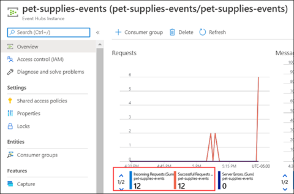

# Event sourcing

The event sourcing pattern is a design pattern that captures events in the same order as they occur. This pattern is used for tasks such as audit trails and data migration. It can also be used as the source of truth in nonrelational data stores when you work with eventual consistency. The Azure Cosmos DB change feed is good for event sourcing, it's append-only and preserves the order of changes. It also captures data add and update events.

The following code sample builds on Cosmos DB trigger for Azure Functions. We send events to *Azure Event Hubs* to trigger notifications for product updates.

Our goal is to use the Cosmos DB change feed to trigger our function. This will then send output to Event Hubs.


## Create Azure Event Hubs resources

To work with Event Hubs, you first need to create an Event Hubs namespace:

```azurecli
az eventhubs namespace create --name pet-supplies-events -g pet-supplies-demo-rg -l eastus
```

Once the namespace is created, then the event hub can be created:

```azurecli
az eventhubs eventhub create --name pet-supplies-events -g pet-supplies-demo-rg --namespace-name pet-supplies-events
```

Once the namespace and event hub are created, then you need to create an authorization rule for accessing the event hub. In this case, we want to publish to the event hub and then view what's in the event hub. Use the following command for this:

```azurecli
az eventhubs eventhub authorization-rule create --resource-group pet-supplies-demo-rg --name pet-supplies-events-auth --eventhub-name pet-supplies-events --namespace-name pet-supplies-events --rights Listen Send
```

Store the event hub connection string in an environment variable:

```azurecli
AZURE_EVENT_HUB_CONNECTION=$(az eventhubs eventhub authorization-rule keys list --eventhub-name pet-supplies-events -g pet-supplies-demo-rg --namespace-name pet-supplies-events --name pet-supplies-events-auth --query primaryConnectionString)
```

## Update the code

We need to update our function to take on the `@EventHubOutput` annotation. We've also updated the return type and are returning the array of objects coming from the change feed. The updated class in **Function.java** should look like this:

```java
public class Function {

/**

 * This function will be invoked when there are inserts or updates in the specified database and collection.

 */

@FunctionName("CosmosDBChangeFeedMonitor")
@EventHubOutput(name = "event", eventHubName = "pet-supplies-events", connection = "AzureEventHubConnection")

public Object[] pushToEventGrid(
   @CosmosDBTrigger(
      name = "items",
      databaseName = "pet-supplies",
      collectionName = "pet-supplies",
      leaseCollectionName="lease",
      connectionStringSetting = "AzureCosmosDBConnectionString",
      createLeaseCollectionIfNotExists = true
   )
   Object[] items,
   final ExecutionContext context
)  {
   context.getLogger().info("Java Cosmos DB trigger function executed.");
   context.getLogger().info("Documents count: " + items.length);
   return items;
   }
}
```

## Update configurations

Update *local.settings.json* to include information from the event hub connection:

```json
{
"IsEncrypted": false,
"Values": {
   "AzureWebJobsStorage": "%AZURE_WEBJOBS_STORAGE%",
   "AzureCosmosDBConnectionString": "%AZURE_COSMOS_CONNECTION_STRING%",
   "AzureEventHubConnection": "%AZURE_EVENT_HUB_CONNECTION%",
   "FUNCTIONS_WORKER_RUNTIME": "java"
   }
}
```

Update the *pom.xml* file to include your new environment variable:

```xml
<property>
   <name>AzureEventHubConnection</name>
   <value>${AZURE_EVENT_HUB_CONNECTION}</value>
</property>
```

> The `@EventHubOutput` annotation's connection property will look for the AzureEventHubConnection application setting.

## Deploy Azure Function

Deploy the previous changes to Azure App Service using the following commands:

```cmd
mvn clean package
mvn azure-functions:deploy
```

When your changes deploy successfully, you should see a new environment variable:


As a test, change your Contoso Pet Supplies data to trigger the change feed.

Wait about 10 minutes, then check Event Hubs for events in the log that are ready to be consumed by its subscribers.



[Next &#124; Sending Notifications with Azure Logic Apps](send-notifications-with-azure-logic-apps.md){: .btn .btn-primary .btn-lg }
