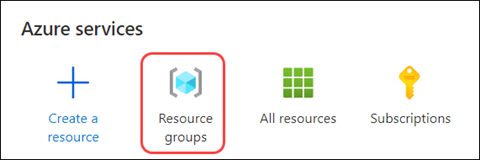
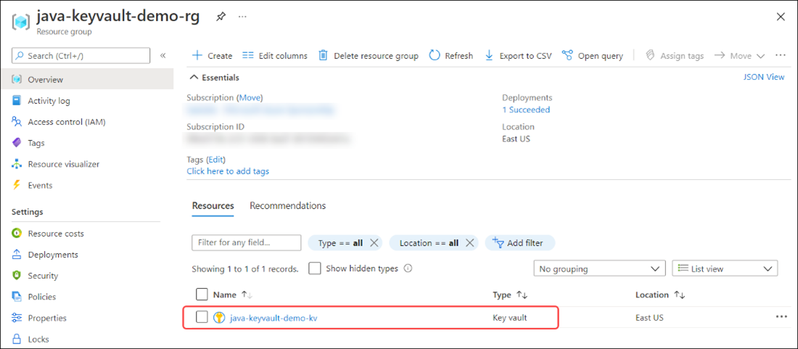
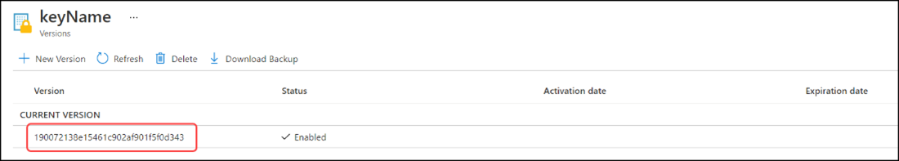
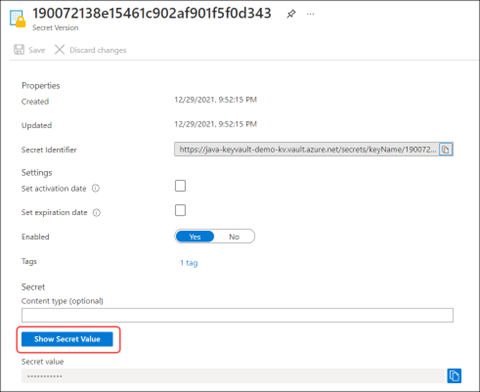
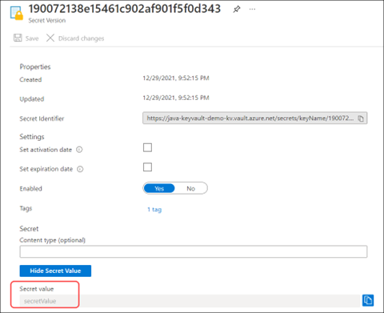
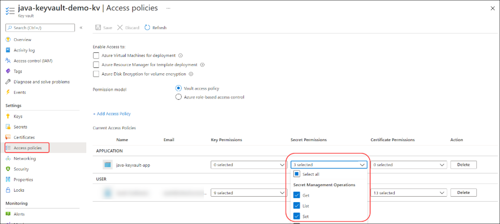
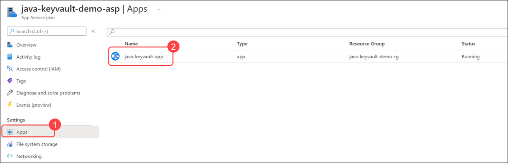
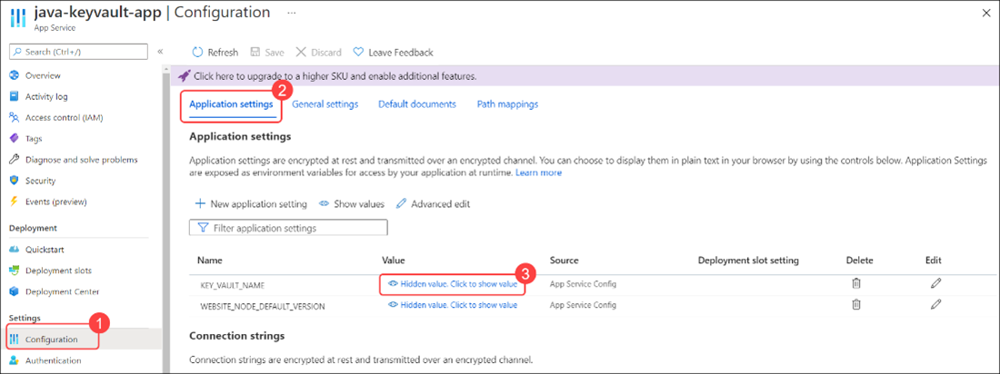
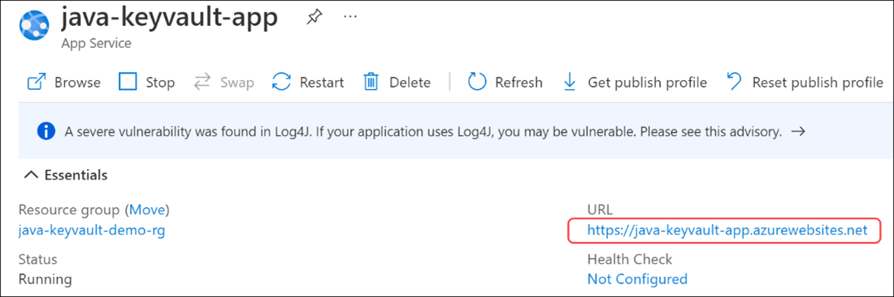

# Get started with Java and Azure Key Vault

When you work with Azure resources from within Azure, you can use managed identities to give resources correct access. System-assigned managed identities are preferable because they live with their associated resources and are deleted when the resource is deleted. In the following example, you create a Spring Boot application that can read a value from Azure Key Vault.

> In this example, suffixes are used on many resource names for clarity on what they represent.

## Prerequisites

- An Azure account

- Azure CLI

- Java 11 or higher

- Maven

## Create a resource group

Create a resource group to store all of the resources in this example. Throughout this example, use the name *java-keyvault-demo-rg*.

1. Sign in to Azure via the CLI with the following command:

   ```azurecli
   az login
   ```

1. Create a resource group with the following command:

   ```azurecli
   az group create --location eastus --resource-group java-keyvault-demo-rg
   ```

## Create a key vault

Throughout this guide, you store connection strings and other application secrets in Azure Key Vault. The upcoming code examples show you how to work with Azure Key Vault in Java. You use the name *java-keyvault-demo-kv*.

1. To create a key vault, you need your resource name and resource group name. Create your key vault with the following command:

   ```azurecli
   az keyvault create  --name java-keyvault-demo-kv -g java-keyvault-demo-rg
   ```

1. Add a secret to your vault so that you can retrieve it by using Java. To create a value in a key vault, you need the vault name, key name, and value. Create a secret with a generic key named *keyName* and a secret value of *secretValue*:

   ```azurecli
   az keyvault secret set  --vault-name java-keyvault-demo-kv --name "keyName" --value "secretValue"
   ```

You now have a key vault with a key available to be fetched.

> Azure key vault names are globally unique. If you input a name that's already in use, you get a VaultAlreadyExists error.

## Confirm the vault setup in the Azure portal

You can view the Azure Key Vault resource and its stored values from the Azure portal.

1. Navigate to the [Azure portal](https://portal.azure.com/).

1. Select **Resource groups**.

   

1. Select the name of your resource group.

1. Select the name of the key vault.

   

1. From the menu on the **Key vault** page, select **Secrets** to load your stored secrets. Then, select the key named **keyName**.

   Different versions of the stored value load.

1. Select the current version to view the stored value.

   

1. Select **Show Secret Value** to see the stored secret value.

   

1. Notice that the secret value can now be revealed.

   

## Create a Java Spring Boot application with Azure Key Vault and run it locally

Now that you have a value to retrieve, create a Java Spring Boot application to get that value. Keep in mind that you use this pattern to store connection strings and other secrets throughout this guide. For this section, you can use the IDE of your choice plus the [Spring Boot Initializr](https://start.spring.io/). This example uses Visual Studio Code with the [Spring Initializr Java Support extension installed](https://marketplace.visualstudio.com/items?itemName=vscjava.vscode-spring-initializr).

### Create the Java Spring Boot example

Visual Studio Code has tools that work with Java. The Spring Initializr Java Support extension creates Spring Boot starters like [https://start.spring.io](https://start.spring.io/) without having to leave the editor and without needing to extract an archive file. You create a Spring Web application with a plan to eventually migrate it to an Azure web hosting resource.

1. Open the command palette in Visual Studio Code. Search for *Spring Initializr*. Select **Spring Initializr: Create a Maven Project**.

1. For the Spring Boot version, select **2.5.8**, which is the most recent stable version below 2.6. This guide uses this version for its examples because many Azure dependencies require versions greater than or equal to 2.2.11.RELEASE, and less than 2.6.0-ML.

   

1. On the **Spring Initializr** page, make the following selections:

   - For **Project** language, select **Java**.

   - For **Group** ID, enter *com.example*.

   - For **Artifact** ID, enter *demo*.

   - For **Packaging** type, select **Jar**.

   - For **Java** version, select **11**.

1. Choose the dependencies for this example by selecting **Spring Web** and **Azure Key Vault**. Then, select **Enter**.

1. Select a folder to generate your project. Then select **Generate into this folder** to generate the boilerplate.

   After the sample is created, Visual Studio Code notifies you that the code is successfully generated.

### Add to the Java Spring Boot-generated app

After you've generated the Java Spring Boot app, you can tailor it to your needs.

1. Add a file to *src\main\java\com\example\demo* named *KeyvaultDemoController.java*.

1. Add the following source code to the file:

   ```java
   package com.example.demo;
   import org.springframework.web.bind.annotation.RequestMapping;
   import org.springframework.web.bind.annotation.RestController;
   import com.azure.identity.DefaultAzureCredentialBuilder;
   import com.azure.security.keyvault.secrets.SecretClient;
   import com.azure.security.keyvault.secrets.SecretClientBuilder;
   import com.azure.security.keyvault.secrets.models.KeyVaultSecret;
  
   @RestController
  
   public class KeyvaultDemoController
   {
      @RequestMapping("/")
      public String getKeyvaultValue()
      {
         return getStoredValue("keyName");
      }
 
      private String getStoredValue(String keyName){
         String keyVaultName = System.getenv("KEY_VAULT_NAME");
         String keyVaultUri = "https://" + keyVaultName + ".vault.azure.net";
         SecretClient secretClient = new SecretClientBuilder()
         .vaultUrl(keyVaultUri)
         .credential(new DefaultAzureCredentialBuilder().build())
         .buildClient();
         KeyVaultSecret storedSecret = secretClient.getSecret("keyName");
         return storedSecret.getValue();
      }
   }
   ```

1. Use `DefaultAzureCredentialBuilder` to manage your credentials for your key vault. When you run the code locally, `DefaultAzureCredentialBuilder` looks for three environment variables: `AZURE_CLIENT_ID`, `AZURE_CLIENT_SECRET`, and `AZURE_TENANT_ID`.

1. You created a service principal to use in our development environment. When the application is deployed to Azure, `DefaultAzureCredentialBuilder` looks for the managed identities and service principals of Azure resources that attempt to access Key Vault. To use `DefaultAzureCredentialBuilder`, you need to add `azure-identity` as a dependency to the *pom.xml* file. Add the following code in the \<dependencies> section of *pom.xml*:

   ```xml
   <dependency>
      <groupId>com.azure</groupId>
      artifactId>azure-identity</artifactId>
   </dependency>
   ```

### Generate the service principal

Set up environment variables for `DefaultAzureCredentialBuilder`. These variables hold values from our service principal.

> Contact your Azure administrator to create a service principal if you don't have the rights to do so in your tenant.

To create a service principal, you first need to choose a name. Use the name **java-keyvault-demo-sp**. Create your service principal using the following command:

```azureclie
az ad sp create-for-rbac -n java-keyvault-demo-sp --role=Contributor
```

This command produces output values similar to the following sample:

```output
{
   "appId": "ac69d748-d878-4019-81c5-063c511d7857",
   "displayName": "java-keyvault-demo-sp",
   "name": "ac69d748-d878-4019-81c5-063c511d7857",
   "password": "nqaZaiJZMPZixptdoLT10Wz9xJSM~DYzzw",
   "tenant": "a98511b4-fa78-4893-bf7b-0eba7bf495f4"
}
```

### Set your environment variables

There are four environment variables to set up locally for this example:

- `KEY_VAULT_NAME`: For this demo, use *java-keyvault-demo-kv*.

- `AZURE_CLIENT_ID`: Set to the appId value.

- `AZURE_CLIENT_SECRET`: Set to the password value.

- `AZURE_TENANT_ID`: Set to the tenant value.

### Package and run locally

1. After you've set your environment variables, run the following command to package the demo:

   ```cmd
   mvn clean package -DskipTests` 
   ```

1. Run the Spring Boot web application in Tomcat:

   ```cmd
   mvn spring-boot:run
   ```

   This command outputs a URL for the web application. Save this URL for later.

1. To confirm the output, use the URL generated by the previous command to open your web application in a web browser.

   You should see *secretValue* displayed in the browser.

## Create a Java Spring Boot application to use Azure Key Vault and run it on Azure

You can communicate with Azure Key Vault locally by using `DefaultAzureCredentialBuilder` and your environment variables. To host your code, move it to Azure as shown in the following sections.

### Deploy a Maven application to Azure App Services

One of the ways to host your application in Azure is through Azure App Services. Azure App Service has some terminology that you need to be aware of:

- Azure App Service plan

   Apps run on an *Azure App Service plan*. It determines the operating system, region, number of virtual machines, size of virtual machines, and the pricing tier. Pricing tiers are built around CPU and compute setups.

- App types

   Three types of apps run on Azure App Service plans: Azure Web Apps, Azure API Apps, and Azure Mobile Apps.

### Set up the Maven plugin and configure it for Azure Web Apps

Use the [Maven Plugin for Azure Web Apps](https://github.com/microsoft/azure-maven-plugins/wiki/Azure-Web-App) to help deploy your application to an Azure App Service.

1. To install the Maven Plugin for Azure Web Apps, run the following command:

   ```cmd
   mvn com.microsoft.azure:azure-webapp-maven-plugin:2.3.0:config`.
   ```

   This command creates the initial settings for your Azure App Service. Your application is deployed to a *Linux* Azure App Service plan with a *Java 11* runtime.

1. After you've complete the configurator, view *pom.xml* and make note of the \<build> section. This section should appear as follows:

   ```xml
   <build>
      <plugins>
         <plugin>
            <groupId>org.springframework.boot</groupId>
            <artifactId>spring-boot-maven-plugin</artifactId>
         </plugin>
         <plugin>
            <groupId>com.microsoft.azure</groupId>
            <artifactId>azure-webapp-maven-plugin</artifactId>
            <version>2.3.0</version>
            <configuration>
               <schemaVersion>v2</schemaVersion>
               <resourceGroup>java-keyvault-demo-rg</resourceGroup>
               <appServicePlanName>java-keyvault-demo-asp</appServicePlanName>
               <appName>java-keyvault-app</appName>
               <region>eastus</region>
               <runtime>
                  <os>Linux</os>
                  <javaVersion>Java 11</javaVersion>
                  <webContainer>Java SE</webContainer>
               </runtime>
               <deployment>
                  <resources>
                     <resource>
                        <directory>${project.basedir}/target</directory>
                        <includes>
                           <include>*.jar</include>
                        </includes>
                     </resource>
                  </resources>
               </deployment>
            </configuration>
         </plugin>
      </plugins>
   </build>
   ```

If you see your *\<SubscriptionId>* in the POM file, remove it; it isn't necessary to store it in this file. Pay attention to the following settings:

- \<appServicePlanName>: Specifies the associated App Service plan.

- \<appName>: Identifies the app in the Azure App Service plan. The Maven Plugin for Azure Web Apps creates the app during deployment.

- \<resourceGroup>: Set to the resource group you created for this example. The configurator doesn't prompt you for the resource group name.

- \<region>: Set to the region of your resource group.

- \<runtime>: Contains the operating system, Java version, and container.

### Create the Azure App Service plan and Web application

Now that you've prepared to move your application to an Azure App Service plan, you can create the Azure resource and configure Azure. Before you do so, you need to create the Azure App Service plan.

When you create an Azure App Service plan, you need a name, resource group, and SKU. Use the name *java-keyvault-demo-asp*, the resource group *java-keyvault-demo-rg*, and the Free SKU. [Learn more about Azure App Service pricing tiers.](https://azure.microsoft.com/pricing/details/app-service/linux/)

To create the Azure App Service plan, run:

```azurecli
az appservice plan create -n java-keyvault-demo-asp -g
java-keyvault-demo-rg --sku FREE --is-linux
```

### Deploy to Azure App Service

When you deploy the app to Azure App Service, it creates the Azure App, if it doesn't already exist. To deploy the application, run:

```cmd
mvn package azure-webapp:deploy
```

The Maven Plugin for Azure Web Apps uses your Azure CLI access token for authentication and publishes the app to Azure.

Although the code is now deployed, it needs to be configured to work successfully.

### Create a system-assigned managed identity for the App Service

Because our application runs within Azure, you can use managed identities to securely access resources. Create a system-assigned managed identity for your Azure Web App, which you can then use with role-based access control and Azure Key Vault vault policies.

To create a managed identity for the web app, run:

```azurecli
az webapp identity assign --name java-keyvault-app --resource-group java-keyvault-demo-rg
```

Make note of the *principalId* in the output.

### Grant your Azure Web App access to Azure Key Vault

For your Azure Web App to access Azure Key Vault, you need to create a vault policy or Azure role assignment for your managed identity. Your key vault is set for vault policies, so you create a vault policy for your managed identity.

The Azure Web App needs to retrieve secrets from Azure Key Vault. It doesn't rotate or change the data.

1. To grant access to the new managed identity, replace \<YOUR_PRINCIPAL_ID> with the principalId value of the system-assigned managed identity.

```azurecli
az keyvault set-policy --name java-keyvault-demo-kv --object-id <YOUR_PRINCIPAL_ID> --secret-permissions set get list
```

1. To verify that access was granted correctly, select **Access policies** and confirm that the managed identity appears under the Application section.

   

### Set the KEY_VAULT_NAME environment variable

You don't explicitly store the key vault name in our application. Instead, you can use application settings with Azure App Service applications. To configure application settings, you need to know your Azure App name, resource group name, and the key-value pair for the application setting.

1. To set the `KEY_VAULT_NAME` variable, run:

   ```azurecli
   az webapp config appsettings set --name java-keyvault-app --resource-group java-keyvault-demo-rg --settings KEY_VAULT_NAME=java-keyvault-demo-kv
   ```

To confirm that the key vault name was set successfully:

1. Navigate to the App Service plan resource in the Azure portal.

1. From the navigation in the App Service plan screen, select **Apps**. Then, select **java-keyvault-app**.

   

1. From the navigation in the **App Service** screen, select **Configuration**. Then, select **Application settings**.

    

1. To see the value of `KEY_VAULT_NAME`, select the **Hidden** value, and then select it to show the **value** link.

   You should see the name of the key vault resource.

### Confirm that the Azure App Service works successfully

After the managed identity is granted access to the key vault and the key vault name environment variable is set, you can confirm that your app works successfully.

1. In the Azure portal, navigate to your Azure App.

1. On the **Overview** pane, find the **URL**. Select the url to go to the deployed app.

   

   The secret value of **secretValue** appears.

## Clean up resources

You can use this app as a guide for working with Java and Spring Boot. It also demonstrates how to use Azure Key Vault to store application secrets and host your Java app on an Azure App Service.

If you don't intend to use this app, you should remove its resources to avoid unnecessary charges Deleting a resource group also deletes its contents.

To delete the resource group, run:

```azurecli
az group delete --name java-keyvault-demo-rg
```

To delete the service principal, which isn't tied to a resource, run:

```azurecli
az ad sp delete --id AZURE_CLIENT_ID
```

[Next &#124; Get started with Java and Azure Cosmos DB](get-started-with-java-and-cosmos-db.md){: .btn .btn-primary .btn-lg }
