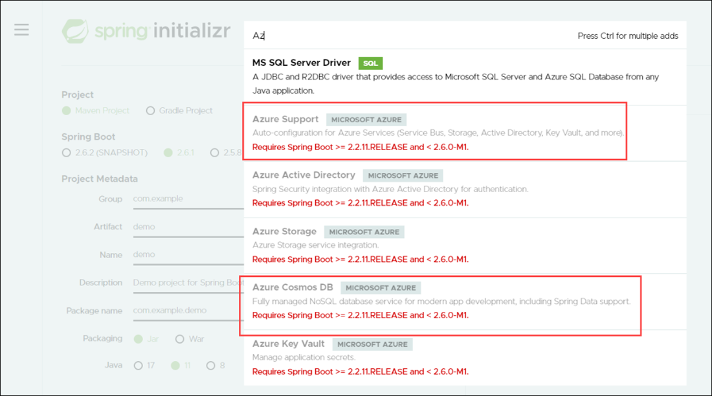

# Get started with Java and Azure Key Vault

When working with Azure resources within Azure itself, you can use managed identities to give resources proper access. System-assigned managed identities are preferred, as they live with their associated resource and are deleted when the resource is deleted. In this example, we'll create a Spring Boot application that can read a value from Azure Key Vault.

> We'll be using suffixes on many resource names to help keep them straight as to what they represent.

## Prerequisites

- An Azure account

- Azure CLI

- Java 11 or higher

- Maven

## Create a resource group

We'll create a resource group to hold all the resources in this example. Throughout this example, we'll use the name **java-keyvault-demo-rg**.

1. Log into Azure via the CLI with the following command:

   ```azurecli
   az login
   ```

1. Create a resource group with the following command:

   ```azurecli
   az group create --location eastus --resource-group java-keyvault-demo-rg
   ```

## Create a key vault

We'll use Azure Key Vault to store a secret value. Throughout this guide, we'll store connection strings and other application secrets in Azure Key Vault. This example is to show how to work with Azure Key Vault in Java. Throughout this example, we'll use the name **java-keyvault-demo-kv**.

1. To create a key vault, you need the resource name and the resource group name. This can be created with:

   ```azurecli
   az keyvault create  --name java-keyvault-demo-kv -g java-keyvault-demo-rg
   ```

1. We want to add a secret to our vault to test getting it with Java. To create a value in a key vault, you need the vault name, key name, and value. We're going to create a generic key named **keyName** with a secret value of **secretValue**. Create this secret with:

   ```azurecli
   az keyvault secret set  --vault-name java-keyvault-demo-kv --name "keyName" --value "secretValue"
   ```

> Azure key vault names are globally unique. If you try to use a name already being used, you'll get a VaultAlreadyExists error.

At this point, you should have a key vault with a key to be fetched.

## Confirm the vault setup in the Azure portal

You can see the Azure Key Vault resource and its stored values within the Azure portal.

1. Navigate to the [Azure portal](https://portal.azure.com/).

1. Select **Resource groups**.

   

1. Select the name of the resource group.

1. Select the name of the key vault.

   

1. From the navigation in the Key Vault resource, select **Secrets** to load the stored secrets. Then, select the key named **keyName**.

   The versions of the stored value loads.

1. Select the current version to look at the stored value.

   

1. Select **Show Secret Value** to see the stored secret value.

   

1. Notice that the secret value can be revealed.

   

## Create a sample Java Spring Boot application to work with Azure Key Vault and run locally

Now that we have a value to retrieve, let's create a Java Spring Boot application to get that value. Keep in mind that we'll be using this pattern to store connection strings and other secrets throughout this guide. For this part, you can use your IDE of choice plus the [Spring Boot Initializr](https://start.spring.io/). We're going to show using Visual Studio Code and the [Spring Initializr Java Support extension](https://marketplace.visualstudio.com/items?itemName=vscjava.vscode-spring-initializr).

### Create the Java Spring Boot sample

Visual Studio Code has tooling for working in Java. The Spring Initializr Java Support extension creates the Spring Boot starters like [https://start.spring.io](https://start.spring.io/) without having to leave the editor and without having to extract an archive file. We're creating a Spring Web application, as we'll eventually migrate this to an Azure web hosting resource.

1. Open the command palette in Visual Studio Code. Search for Spring Initializr. Select **Spring Initializr: Create a Maven Project ...**.

1. For the Spring Boot version, select **2.5.8**. This is the version we'll need to use throughout this guide, as many of the Azure dependencies have a requirement of greater than or equal to 2.2.11.RELEASE and less than 2.6.0-ML, so we'll use the latest stable Spring Boot below 2.6.

   

1. For the project language, select **Java**.

1. For the Group ID, enter com.example. Press **Enter**.

1. For the Artifact ID, enter demo. Press **Enter**.

1. For the packaging type, select **Jar**.

1. For the Java version, select **11**.

1. For the dependencies for this example, select **Spring Web** and **Azure Key Vault**. Then, press **Enter**.

1. Select a folder to generate your project. Then select **Generate into this folder** to generate the boilerplate.

1. Once this sample is created, Visual Studio Code will show a notification that the code was successfully generated.

### Add to the Java Spring Boot generated app

Once we have the Spring Boot generated app, then we need to tailor it to our needs.

1. Add a file to **src\main\java\com\example\demo** named **KeyvaultDemoController.java**.

1. Add the following source code to the file:

   ```java
   package com.example.demo;
   import org.springframework.web.bind.annotation.RequestMapping;
   import org.springframework.web.bind.annotation.RestController;
   import com.azure.identity.DefaultAzureCredentialBuilder;
   import com.azure.security.keyvault.secrets.SecretClient;
   import com.azure.security.keyvault.secrets.SecretClientBuilder;
   import com.azure.security.keyvault.secrets.models.KeyVaultSecret;
  
   @RestController
  
   public class KeyvaultDemoController
   {
      @RequestMapping("/")
      public String getKeyvaultValue()
      {
         return getStoredValue("keyName");
      }
 
      private String getStoredValue(String keyName){
         String keyVaultName = System.getenv("KEY_VAULT_NAME");
         String keyVaultUri = "https://" + keyVaultName + ".vault.azure.net";
         SecretClient secretClient = new SecretClientBuilder()
         .vaultUrl(keyVaultUri)
         .credential(new DefaultAzureCredentialBuilder().build())
         .buildClient();
         KeyVaultSecret storedSecret = secretClient.getSecret("keyName");
         return storedSecret.getValue();
      }
   }
   ```

1. We're using the DefaultAzureCredentialBuilder to manage our credentials for Azure key vault. This allows us to use credentials. When running the code locally, the DefaultAzureCredentialBuilder is looking for three environment variables: AZURE_CLIENT_ID, AZURE_CLIENT_SECRET, and AZURE_TENANT_ID. We'll create a service principal to use in our development environment. When the application is deployed to Azure, the DefaultAzureCredentialBuilder will look for managed identities and service principals tied to the respective Azure resource trying to access Key Vault. To use the DefaultAzureCredentialBuilder, we need to add azure-identity as a dependency to the **pom.xml** file. Add the following code in the \<dependencies> section of pom.xml:

   ```xml
   <dependency>
      <groupId>com.azure</groupId>
      artifactId>azure-identity</artifactId>
   </dependency>
   ```

### Generate the service principal

We need to set up the environment variables for the `DefaultAzureCredentialBuilder`. These variables will hold values from our service principal.

> Contact your Azure administrator to create the service principal if you don't have the rights to do so in your tenant.

To create a service principal, it needs a name. We're using the name **java-keyvault-demo-sp**. Create the service principal with the following command:

```azureclie
az ad sp create-for-rbac -n java-keyvault-demo-sp --role=Contributor
```

The output comes back with values like this:

```output
{
   "appId": "ac69d748-d878-4019-81c5-063c511d7857",
   "displayName": "java-keyvault-demo-sp",
   "name": "ac69d748-d878-4019-81c5-063c511d7857",
   "password": "nqaZaiJZMPZixptdoLT10Wz9xJSM~DYzzw",
   "tenant": "a98511b4-fa78-4893-bf7b-0eba7bf495f4"
}
```

### Set the environment variables

There are four environment variables to set up locally for this example:

- KEY_VAULT_NAME: For our demo, we're using **java-keyvault-demo-kv**.

- AZURE_CLIENT_ID: Set this to the appId value.

- AZURE_CLIENT_SECRET: Set this to the password value.

- AZURE_TENANT_ID: Set this to the tenant value.

### Package and run locally

Once everything has been configured, run `mvn clean package -DskipTests` to package the demo.

Run the Spring Boot web application in Tomcat with: `mvn spring-boot:run`.

### Confirm the output

Open the website in a web browser. You should see secretValue displaying in the browser.

## Create a sample Java Spring Boot application to work with Azure Key Vault and run on Azure

We can communicate with Azure Key Vault locally using the `DefaultAzureCredentialBuilder` and environment variables. Now let's move our code to be hosted in Azure.

## Deploy a Maven Application to Azure App Services

One of the ways to host your application in Azure is through Azure App Services. Azure App Service has some terminology to be aware of:

- Azure App Service plan: Apps run on an App Service plan. It determines operating system, region, number of virtual machines, size of virtual machines, and a pricing tier. The pricing tiers are built around CPU and compute setups.

- App types: There are three main types of apps that run on Azure App Service plans - Azure Web Apps, Azure API Apps, and Azure mobile Apps.

### Set up the Maven plugin and configuration for Azure Web Apps

There's a [Maven Plugin for Azure Web Apps](https://github.com/microsoft/azure-maven-plugins/wiki/Azure-Web-App). We'll use this to assist in deploying our application to an Azure App Service.

To install the Maven Plugin for Azure Web Apps, run the following command: 

```cmd
mvn com.microsoft.azure:azure-webapp-maven-plugin:2.3.0:config`.
```

This will run through getting the initial settings for an Azure App Service. For our application, we'll deploy to a **Linux** Azure App Service plan with the **Java 11** runtime.

Once you run through the configurator, then look at **pom.xml**. Make note of the \<build> section. It should look like this:

```xml
<build>
   <plugins>
      <plugin>
         <groupId>org.springframework.boot</groupId>
         <artifactId>spring-boot-maven-plugin</artifactId>
      </plugin>
      <plugin>
         <groupId>com.microsoft.azure</groupId>
         <artifactId>azure-webapp-maven-plugin</artifactId>
         <version>2.3.0</version>
         <configuration>
            <schemaVersion>v2</schemaVersion>
            <resourceGroup>java-keyvault-demo-rg</resourceGroup>
            <appServicePlanName>java-keyvault-demo-asp</appServicePlanName>
            <appName>java-keyvault-app</appName>
            <region>eastus</region>
            <runtime>
               <os>Linux</os>
               <javaVersion>Java 11</javaVersion>
               <webContainer>Java SE</webContainer>
            </runtime>
            <deployment>
               <resources>
                  <resource>
                     <directory>${project.basedir}/target</directory>
                     <includes>
                        <include>*.jar</include>
                     </includes>
                  </resource>
               </resources>
            </deployment>
         </configuration>
      </plugin>
   </plugins>
</build>
```

If you see your SubscriptionId in the POM file, remove it. That isn't necessary for storing in this file. Pay close attention to these settings:

- \<appServicePlanName> is used to specify the associated App Service plan.

- \<appName> will be used for the app in the Azure App Service plan. This tool will create the app as part of the deployment.

- \<resourceGroup> should be set to the resource group you created for this example. The configurator doesn't prompt you for the resource group name.

- \<region> should be set to the region of your resource group.

- \<runtime> contains the operating system, Java version, and container.

### Create the Azure App Service Plan and Web Application

Now that our application is prepared to move to an Azure App Service plan, let's create the Azure resource and get the Azure side configured. First, we need to create the Azure App Service plan.

When creating an Azure App Service plan, we need a name, resource group, and SKU. We'll use the name **java-keyvault-demo-asp**, the **java-keyvault-demo-rg** resource group, and the FREE SKU. [Learn more about Azure App Service pricing tiers.](https://azure.microsoft.com/pricing/details/app-service/linux/)

To create the Azure App Service plan, run:

```azurecli
az appservice plan create -n java-keyvault-demo-asp -g
java-keyvault-demo-rg --sku FREE --is-linux
```

### Deploy to Azure App Service

When we deploy the app to the Azure App Service, it will create the Azure App if it doesn't exist. To deploy the application, run:

```cmd
mvn package azure-webapp:deploy
```

The Maven Plugin for Azure Web Apps will use your Azure CLI access token for authentication and publish the app to Azure.

> At this point, code is deployed but there's some configuration needed to get it working properly.

### Create a system-assigned managed identity for the App Service

Since our application will be running within Azure, we can use managed identities to securely access resources. We'll create a system-assigned managed identity for our Azure Web App that we can then use with role-based access control and Azure Key Vault vault policies.

To create the managed identity for the web app, run:

```azurecli
az webapp identity assign --name java-keyvault-app --resource-group java-keyvault-demo-rg
```

Make note of the **principalId** that came back.

### Grant the Azure Web App access to Azure Key Vault

For the Azure Web App to access Azure Key Vault, we need to create a vault policy or RBAC role assignment for our managed identity. Our Key Vault is set for vault policies, so we'll create a vault policy for our managed identity.

The Azure Web App needs to be able to retrieve secrets from Azure Key Vault. It will not be rotating the data or changing the data.

To grant access to the new managed identity, replace YOUR_PRINCIPAL_ID with the principalId value for the system-assigned managed identity.

```azurecli
az keyvault set-policy --name java-keyvault-demo-kv --object-id YOUR_PRINCIPAL_ID --secret-permissions set get list
```

You can confirm the access worked properly by viewing the **Access policies** and noticing the managed identity appears under the Application section.


### Set the KEY_VAULT_NAME environment variable

We didn't explicitly store the key vault name in our application. With Azure App Service applications, there are application settings that can be used. To set the application setting, you need to know the Azure App name, resource group name, and the key-value pair for your application setting.

To set the KEY_VAULT_NAME variable, run:

```azurecli
az webapp config appsettings set --name java-keyvault-app --resource-group java-keyvault-demo-rg --settings KEY_VAULT_NAME=java-keyvault-demo-kv
```

To confirm it was set properly:

1. Navigate to the App Service plan resource in the Azure portal.

1. From the navigation in the App Service plan screen, select **Apps**. Then, select **java-keyvault-app**.

   

1. From the navigation in the App Service screen, select **Configuration**. Then, select **Application settings**.

    

1. To view the value for KEY_VAULT_NAME, select its respective **Hidden** value. Click to show **value** link. You should see the name of the key vault resource.

### Confirm the Azure App Service

Once the managed identity is granted access to the key vault and the key vault name environment variable is set, then you can confirm that your app is working properly.

1. In the Azure portal, navigate to your Azure App.

1. On the overview, look for the **URL**. Select the link to go to the deployed app.

   

   The secret value of **secretValue** appears.

## Tear down

This app can serve as a guide of working with Java and Spring Boot, using Azure Key Vault to store your application secrets and hosting your Java app on an Azure App Service. When you're done going through this example, you can clean up by deleting the resource group with:

```azurecli
az group delete --name java-keyvault-demo-rg
```

We also created a service principal, which isn't tied to a resource. To delete the service principal, run:

```azurecli
az ad sp delete --id AZURE_CLIENT_ID
```

[Next &#124; Get started with Java and Azure Cosmos DB](get-started-with-java-and-cosmos-db.md){: .btn .btn-primary .btn-lg }
