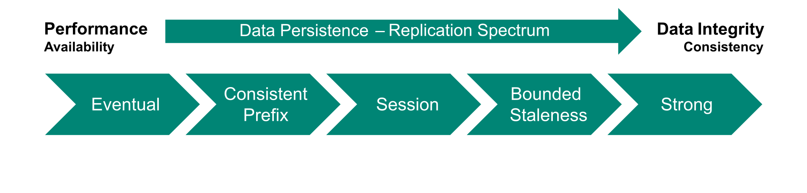

# What is Azure Cosmos DB?

Azure Cosmos DB is a fully managed, distributed NoSQL database service. It's a globally distributed, massively scalable, multi-model database service. Unlike many other non-relational databases, Azure Cosmos DB offers [five consistency models](#consistency-models) for data durability. 

## Non-relational database

While Azure SQL DB is the flagship Azure product for *relational* data, Azure Cosmos DB is the flagship product for *non-relational* data. Azure Cosmos DB supports document data such as product information on an eCommerce site, blog posts on a website, and user profiles. Other non-relational data could include column-family data such as content management, sensor logs, and time series data. Graph data is used for applications such as recommendation engines, fraud detection algorithms, networks, and other relationship trends. Azure Cosmos DB supports these non-relational data types and schema-less JSON.

## Globally distributed

Global distribution is one of the key pillars of Azure Cosmos DB. It's built to support globally accessible data, with low latency at the 99th percentile, elastic scalable throughput, and high availability. Data in Azure Cosmos DB is automatically synchronized across replicas in multiple regions. Since it's a foundational part of Azure, Cosmos DB is distributed in all regions in the four key Azure cloud environments:

* Azure public cloud
* Azure Government
* Azure Government for Department of Defense
* Azure China 21Vianet

Data can be configured to be readable and writeable across multiple regions. There are service-level agreements (SLAs) guaranteed for Azure Cosmos DB resources based on different conditions. For more information about the SLAs, see [SLA for Azure Cosmos DB](https://azure.microsoft.com/support/legal/sla/cosmos-db/).

## Massively scalable

Azure Cosmos DB is horizontally scalable. Capacity can be added to increase storage and throughput as needed, scaling from tens to hundreds of millions of requests per second over multiple regions. With autoscaling capability, you can trust that Azure Cosmos DB will scale out when needed to accommodate surges in activity.

Azure Cosmos DB can be configured to scale according to your needs. You can manually set throughput for when you have predictable request traffic. It can also autoscale to a pre-determined maximum throughput. 

While the system is massively scalable, there are quotas around resources such as the maximum storage across all items per partition. For more information, see [Azure Cosmos DB service quotas](https://docs.microsoft.com/azure/cosmos-db/concepts-limits).

## Maintenance

Azure Cosmos DB's infrastructure is maintained by Microsoft. Other than configuring and tuning your application, you aren't responsible for the hardware, operating system, or any other infrastructure maintenance.

## Throughput and costs

The cost of database operations in Azure Cosmos DB is expressed in a rate-based currency called Request Units (RUs). RUs are calculated based on usage of CPU, IOPS, and memory resources. For example, getting a 1-KB item by its partition key and ID is one RU. Throughput can be provisioned at the database level and at the container level.

Traditional Azure Cosmos DB pricing for the provisioned throughput capacity mode is broken into two components: provisioned throughput and consumed storage. The serverless capacity mode is handled on usage. For more information on choosing the capacity mode, see [how to choose between provisioned throughput and serverless](https://docs.microsoft.com/azure/cosmos-db/throughput-serverless).

For more information on managing costs, see [plan and manage costs for Azure Cosmos DB](https://docs.microsoft.com/azure/cosmos-db/plan-manage-costs).

## Multi-model with multiple APIs

Azure Cosmos DB is considered multi-model because data can be stored in diverse ways. APIs can be used with each of these models. The models and their supported APIs in Azure Cosmos DB include:

* Key-value data using the Azure Cosmos DB Table API.
* Column-family data using the Azure Cosmos DB API for Cassandra.
* Document data using the Azure Cosmos DB API for MongoDB.
* Graph data using the Azure Cosmos DB API for Gremlin.

The Core (SQL) API is the main API for interacting with Azure Cosmos DB, used for querying JSON objects. When features are introduced, it's the first API to see the updates. This guide uses the SQL API.

While the SQL API may suggest relational data could work in Azure Cosmos DB, this database platform was built with NoSQL in mind. The flavor of SQL with this API is designed for querying JSON data and structures.

## Consistency models

Most non-relational databases support two consistency models: eventual and strong. However, Azure Cosmos DB supports five consistency models on a sliding scale.

These models from weakest to strongest are:

* Eventual
* Consistent Prefix
* Session
* Bounded Staleness
* Strong

### Eventual consistency

*Eventual* is the weakest consistency offered by Azure Cosmos DB. Order isn't guaranteed for reading with the eventual consistency. Replicas eventually synchronize up in a break from writes. With the eventual consistency, it's possible to read older data rather than the most updated commit.

### Consistent Prefix consistency

With *consistent prefix* consistency, reads won't see out-of-order writes. Not all writes may come through on a read, but their order is persisted. So, if three writes happen and then a read, the read may pick up the commit from write 1 or the commits from write 1 and write 2. However, it wouldn't pick up the writes out of order, such as write 1 and write 3, missing write 2.

### Session consistency

*Session* is the mid-grade consistency offered in Azure Cosmos DB. It builds on top of *consistent prefix* consistency and offers monotonic reads and writes, read-your-writes, and write-follow-reads. *Session* is the default consistency level. It guarantees that the updated item will be read if the user writes something.

### Bounded Staleness consistency

*Bounded staleness* is the second strongest of consistency models offered in Azure Cosmos DB. It's also built on top of *consistent prefix* consistency. With *bounded staleness* consistency, reads will have some lag behind the writes. The lag can be configured based on two different criteria: the number of K versions of an item or a time interval T. The minimum lag configuration is:

| Number of regions | Minimum write operations (K) | Minimum time interval (T) |
| ---: | :--- | :--- |
| **Single** | 10 | 5 seconds |
| **Multiple** | 100,000 | 300 seconds (5 minutes) |

### Strong consistency

The strongest consistency model offered by Azure Cosmos DB is *Strong*. This consistency guarantees that reads return the most recent committed data. There are no dirty reads, meaning there's no reading of uncommitted data. There are no nonrepeatable nor phantom reads. Regardless of where the write happens, all regions will serve up the same response to a query.

## Data durability

If there's a region-wide outage, the recovery point objective (RPO)&mdash;the amount of time you're able to lose&mdash;is tied to the consistency level. The RPO is dependent on the number of regions, the replication mode, and the consistency level. Consider the table below to show how they matter.

| Consistency level | RPO if region outage |
| ---: | :--- |
| Session, Consistent Prefix, Eventual | < 15 minutes |
| Bounded Staleness | K & T |
| Strong | 0 |

For more information on consistency levels, see [consistency levels in Azure Cosmos DB](https://docs.microsoft.com/azure/cosmos-db/consistency-levels).

## Next steps

[Learn about security in Azure Cosmos DB](security.md)
