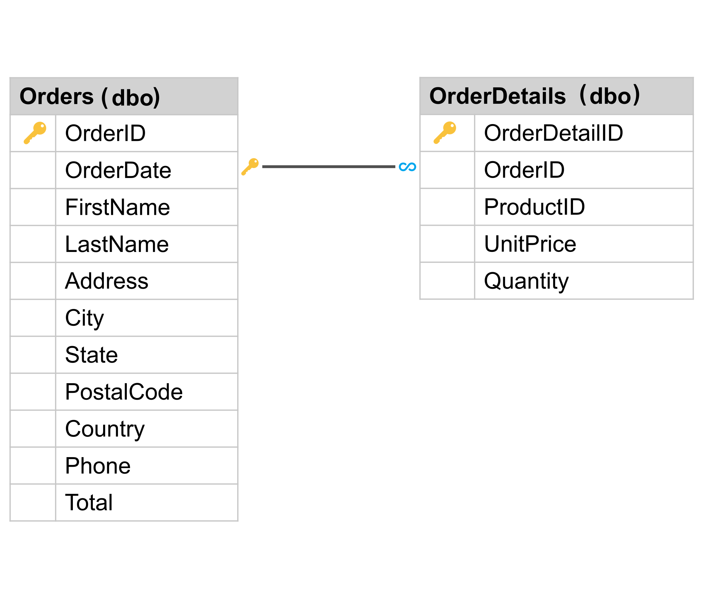

# What is NoSQL?

The term *NoSQL* was introduced in 2009 and describes a type of non-relational, distributed database. NoSQL databases can efficiently query and serve substantial amounts of semi-structured and unstructured data. Unlike relational databases, NoSQL databases are schema-agnostic. NoSQL databases don't define a specific columnar structure, which allows for greater flexibility, less brittle systems, and support for rapidly changing or unstructured data.



In the diagram above, you can see that relational tables have a defined schema. Specific columns and their types represent each table's structure, and relationships are represented via foreign keys. For example, a single **Orders** row may have many **Order Details** rows associated with it. To query this information in its entirety, you must join both tables.

In stark contrast, the NoSQL document below depicts the same **Order/Order Details** relationship via an internal object array in a single document.

```json
{
  "orderId": "873sdfs42981",
  "orderDate": 1574161910220,
  "firstName": "Zhenis",
  "lastName": "Omar",
  "address": "123 Broad Street",
  "city": "Seattle",
  "state": "WA",
  "postalCode": "92839",
  "orderDetails": [
    {
      "orderDetailId": "ds23fhjsdk1",
      "productId": "sdf2378",
      "unitPrice": 7.99,
      "quantity": 1
    },
    {
      "orderDetailId": "zct687786es",
      "productId": "d87f98z",
      "unitPrice": 4.59,
      "quantity": 3
    }
  ]
}
```

Retrieving a single **Order** and its associated **Order Details** involves the lookup of a single document.

## Benefits of NoSQL

NoSQL databases are open-source, distributed, and non-relational. These characteristics lend themselves to the following benefits:

* Non-relational allows storage of semi-structured and unstructured data
* Schema-less, which allows flexible data models
* Rapidly adaptive to changing requirements
* Horizontally scalable due to the distributed nature
* Highly available due to the distributed nature

If you're coming from a relational background and still aren’t sure how NoSQL differs, see [Understanding the differences between NoSQL and relational databases](https://docs.microsoft.com/azure/cosmos-db/relational-nosql).

## NoSQL options

The NoSQL space offers many options. When choosing a NoSQL database system, consider what kind of data you'll work with:

* Key-value data
* Column-family data
* Document data
* Graph data
* Schema-less JSON

In this guide, we'll introduce you to Azure Cosmos DB, Microsoft's flagship non-relational database that supports each of these data options. You'll see an application that uses the Azure Cosmos DB Core (SQL) API to work with schema-less JSON.

## NoSQL for our scenario

You'll see the benefits of NoSQL in our Contoso pet store eCommerce example.

While the data may seem relational, there are cases for non-relational stores. New product information may come from vendors in various formats: structured, semi-structured, or unstructured. You may need to scale your operations for large traffic, such as running sales on an eCommerce site. Reporting on this data may be complicated.

[Next &#124; Introduction to Azure Cosmos DB](intro-cosmos.md){: .btn .btn-primary .btn-lg }
