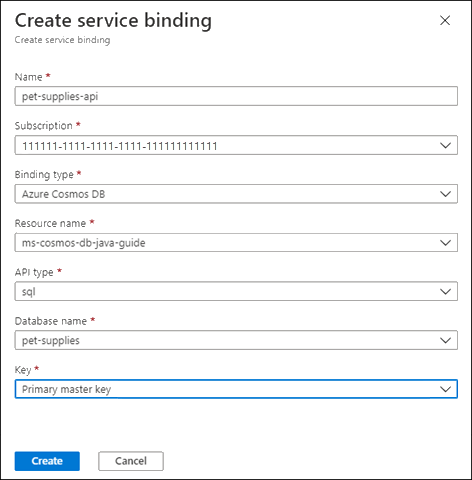

## Migrate to Azure Spring Apps

If you want to use microservices and Java in Azure, consider [Azure Spring Apps](https://docs.microsoft.com/azure/spring-apps/). It allows you to easily migrate Sprint Boot microservices to Azure without needing to change your code. It also supports scaling microservices, both vertically and horizontally, which makes it a smart choice for a Spring Boot native application host.

The components of Azure Spring Apps include:

- [Config Server](https://docs.microsoft.com/azure/spring-apps/how-to-config-server)

- [Spring Boot](https://spring.io/projects/spring-boot) microservices

- [Service Registry](https://docs.microsoft.com/azure/spring-apps/how-to-service-registration) for discovering microservices

When you deploy your sample application to Azure Spring Apps, you can divide it into the following parts:

- Pet supplies services

- Discovery service

- Config Server linked to a Git repository


## Create an Azure Spring Apps instance

Create an Azure Spring Apps instance to hold your resources:

1. To use Azure Spring Apps with Azure CLI, you might be prompted to install the *spring* extension. You can also install the extension manually with the following command:

   ```azurecli
   az extension add --name spring
   ```

1. As you name your Azure Spring Apps instance, keep the following points in mind:

   - The name can contain only lowercase letters, numbers and hyphens as follows:
     - The first character must be a letter.
     - The last character must be a letter or number.
     - The name must be between 4 and 32 characters long.

   - The name of an Azure Spring Apps instance must be unique across all of Azure. To achieve this uniqueness, you might need to use identifying prefixes or suffixes.

1. Set these environment variables as follows:

   - `AZURE_RESOURCE_GROUP=ms-cosmos-db-java-guide`
   - `AZURE_SPRING_CLOUD_NAME=ms-cosmos-db-java-guide-spring-SUFFIX`

1. For this example app, run the following command. Because this application isn't a production application, use the Basic SKU:

   ```azurecli
   az spring create -n $AZURE_SPRING_CLOUD_NAME -g $AZURE_RESOURCE_GROUP --sku Basic
   ```

   After you run this command, it creates an Application Insights component for gathering analytics and telemetry.

1. Set the session defaults for the resource group and Azure Spring Apps instance names so that you don't need to enter them for every command:

   ```azurecli
   az configure --defaults group=$AZURE_RESOURCE_GROUP
   az configure --defaults spring-cloud=$AZURE_SPRING_CLOUD_NAME
   ```

### Config Server

The Config Server needs a Git repository to store the Spring Boot configuration files. Using a Git repository has the following advantages:

- Your configuration is stored in a central location, making it easier to maintain.

- You can secure your Git repository to limit access to specific applications and users.

- With the configuration stored in a Git server, it's easy to push changes or roll them back as needed.

- Your secrets don't need to be stored with the application itself.

The Git repository can be public, secured by SSH, or secured using HTTP basic authentication.

You can store the configuration files in YAML in *application.yml* or in name-value pairs in *application.properties*.

To run a Config Server:

1. Create a Git repository with an *application.yml* or *application.properties* file to store the configuration needed for the services.

   The following sample shows the *application.properties* file for the Config Server:

   ```properties
   # azure.cosmos properties are needed for the CosmosConfiguration bean
   # azure.cosmosdb values are from Service bindings on Azure Spring Apps application
   azure.cosmos.uri=${azure.cosmosdb.uri}
   azure.cosmos.key=${azure.cosmosdb.key}
   azure.cosmos.database=${azure.cosmosdb.database}
   azure.cosmos.populateQueryMetrics=false
   # Disabling web security for the spring project
   spring.autoconfigure.exclude=org.springframework.boot.autoconfigure.security.servlet.SecurityAutoConfiguration
   ```

1. Create a Git personal access token (PAT) with repo access for the Config Server to use.

1. In the [Azure portal](https://portal.azure.com), navigate to the Azure Spring Apps instance.

1. On the left menu, select **Config Server**.

   :::image type="content" source="media/migrate-to-azure-spring-apps/azure-spring-apps-config-server.png" alt-text="Screenshot showing the Azure Spring Apps page with Config Server selected.":::

1. On the **Config Server** page, add a default repository with the following details:

    - **URI**: Git repository URI, including the *.git* extension.

    - **Label**: The branch or tag to use, which defaults to main.

    - **Search Path**: \<blank>

    - **Authentication**: Select **Public** to display the **Edit Authentication** popup and configure the following settings:

       - **Authentication Type**: Select **HTTP Basic**, which displays the **Username** and **Password** fields.

       - **Username**: Enter your Git username.

       - **Password/Personal access token**: Enter your password or personal access token.

   :::image type="content" source="media/migrate-to-azure-spring-apps/config-server-settings.png" alt-text="Screenshot showing the Config Server settings.":::

1. From the top menu, select **Validate**. After the settings are validated, select **Apply**.

   Your service settings are now stored in the *application.properties* or *application.yml* file in the Config Server repository.

## Deploy a Maven application to Azure Spring Apps

Deploy your service, complete with CRUD, to Azure Spring Apps.

### Create the Azure Spring Apps application

After you create the Azure Spring Apps instance, you need to create an app for it. Each service has its own app.

To create a new app:

1. Gather the following information:

   - Name of the Azure resource group to use

   - Name for the Azure Spring Apps instance

   - Name for the app

   - Runtime version

   You can also specify whether to assign an endpoint and assign a managed identity. You'll assign an endpoint for it, because this app should be public. Because you're not explicitly granting access between Azure resources, you won't create a managed identity on this sample app.

1. Enter the following command to create the Azure Spring Apps pet-supplies-app application:

   ```azurecli
   az spring app create -n pet-supplies-app --runtime-version Java_11 --assign-endpoint true
   ```

### Link the Azure Spring Apps application to Azure Cosmos DB

After you create the app, add a service binding for the app to talk directly with Azure Cosmos DB:

1. In the Azure portal, navigate to the Azure Spring Apps resource.

1. Select the **pet-supplies-app** app.

1. From the left menu, select **Service bindings**. Then, select **Create service binding**.

   

1. In the **Create service binding dialog**, configure the following settings:

   - **Name**: Enter the name for the service binding, *pet-supplies-api*.

   - **Subscription**: Choose your subscription.

   - **Binding type**: Select **Azure Cosmos DB**.

   - **Resource name**: Select your Azure Cosmos DB instance.

   - **API type**: Select **sql**.

   - **Database name**: Select **pet-supplies**.

   - **Key**: Select **Primary master key**.

   

1. After you've finished configuring the settings, select **Create**.

1. After the service binding is created, select **pet-supplies-api** from the Binding Name column.

   The **View service binding** dialog appears. Notice that the **Property** section has the settings needed for connecting to Azure Cosmos DB. Use these settings rather than storing the connection information in Azure Key Vault.

   

### Set up logging (optional)

Setting up diagnostic logging makes it easier to debug issues in deploying the Azure Spring Apps solution, because you can then query the logs for information.

To set up diagnostic logging, follow these steps:

1. Create a log workspace with the following Azure CLI command:

   ```azurecli
   az monitor log-analytics workspace create --workspace-name ms-cosmos-db-java-guide-logs
   ```

   After the log workspace is created, you're ready to set up diagnostic logging.

1. In the Azure portal, navigate to the Azure Spring Apps instance.

1. From the left menu, select **Diagnostic settings**. Then, select **Add diagnostic setting**.

   :::image type="content" source="media/migrate-to-azure-spring-apps/select-add-diagnostic-setting.png" alt-text="Screenshot showing the Diagnostic settings page of the Azure Spring Apps instance with Add diagnostic setting selected.":::

1. Configure the following settings:

   - Set the **Diagnostic setting name** to **write-all-logs**.

   - Select all categories under **Logs**.

   - Under **Metrics**, select **AllMetrics**.

   - In **Destination details**, select **Send to Log Analytics workspace**, and then specify the log workspace you just created.

1. Select **Save**.

## Deploy the code to Azure Spring Apps application

After you create the Azure Spring Apps instance and app, you can deploy the code to the Azure Spring Apps application:

1. Gather the following information:

   - App name
   - Azure Spring Apps instance name (service)
   - Azure resource group name
   - Artifact path

1. Enter the following command:

   ```azurecli
   az spring app deploy -n pet-supplies-app --artifact-path target/demo-0.0.1-SNAPSHOT.jar
   ```

   After this command is complete, you'll see a JSON response object in the output, which indicates that the deployment was successful.

1. You can now use the URL of the app to test access. To do so, use the following curl command:

   ```curl
   curl $(az spring app list --query "[?name=='pet-supplies-app'].[properties.url]" -o tsv)
   ```

## Clean up resources

To avoid unnecessary expenses, remove the Basic SKU you created after you're finished and delete the resource group, which also deletes its contents.

## Learn more

To learn more about Azure Spring Apps, see the following resources:

- [Azure Spring Apps documentation](https://docs.microsoft.com/azure/spring-apps/)

- [Azure Spring Apps training](https://github.com/microsoft/azure-spring-cloud-training)

- [Azure Spring Apps pricing](https://azure.microsoft.com/pricing/details/spring-apps)
