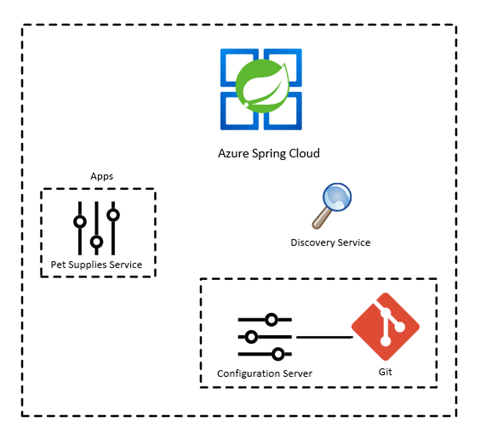
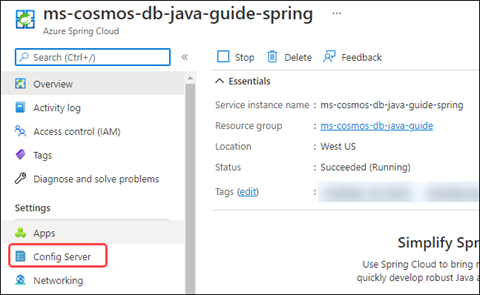
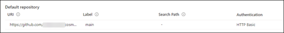
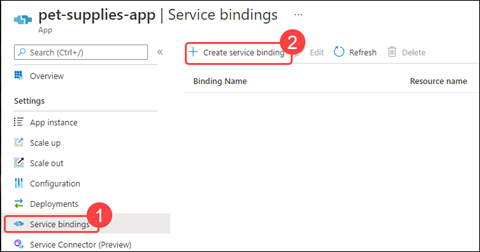
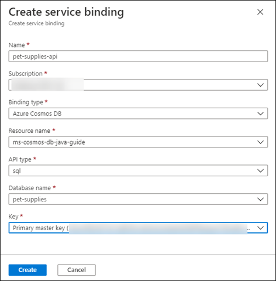
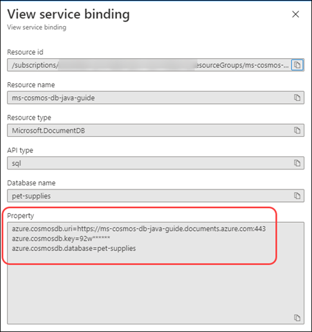
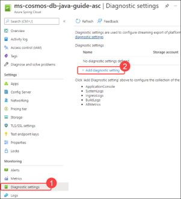

## Migrate to Azure Spring Cloud

If you want to use microservices and Java in Azure, consider Azure Spring Cloud. It allows you to easily migrate Sprint Boot microservices to Azure without needing to change your code. It also supports scaling microservices, both vertically and horizontally, which makes it a smart choice for a Spring Boot Cloud native application host.

The components of Azure Spring Cloud include:

- Azure Spring Cloud configuration server

- Spring Boot microservices

- Azure Spring Cloud registry for discovering microservices

When you deploy your sample application to Azure Spring Cloud, you can divide it into the following parts:

- Pet supplies services

- Discovery service

- Azure Spring Cloud configuration server linked to a Git repository



## Create an Azure Spring Cloud instance

Create an Azure Spring Cloud instance to hold your resources:

1. To use Azure Spring Cloud with Azure CLI, you might need to install the **spring-cloud** extension. To do so, run the following command:

```azurecli
az extension add --name spring-cloud
```

1. As you name your Azure Spring Cloud instance, keep the following points in mind:

   - The name can contain only lowercase letters, numbers and hyphens as follows:
     - The first character must be a letter.
     - The last character must be a letter or number.
     - The name must be between 4 and 32 characters long.

   - The name of an Azure Spring Cloud must be unique across all of Azure. To help achieve this uniqueness, you might need to use identifying prefixes or suffixes.

1. Set the following environment variables:

   - AZURE_RESOURCE_GROUP=ms-cosmos-db-java-guide
   - AZURE_SPRING_CLOUD_NAME=ms-cosmos-db-java-guide-spring-SUFFIX

1. For this example app, run the following command. Because this application isn't a production application, use the Basic SKU:

   ```azurecli
   az spring-cloud create -n $AZURE_SPRING_CLOUD_NAME -g $AZURE_RESOURCE_GROUP --sku Basic
   ```

   After you run this command, it creates an Application Insights component for gathering analytics and telemetry.

1. Set the session defaults for the resource group and Azure Spring Cloud names so that you don't need to enter them for every command:

   ```azurecli
   az configure --defaults group=$AZURE_RESOURCE_GROUP
   az configure --defaults spring-cloud=$AZURE_SPRING_CLOUD_NAME
   ```

### Azure Spring Cloud configuration server

The Azure Spring Cloud configuration server needs a Git repository for storing the Spring Boot configuration files. Using a Git repository has the following advantages:

- Your configuration is stored in a central location, making it easier to maintain.

- You can secure your Git repository to limit access to specific applications and users.

- With the configuration stored in a Git server, it's easy to push changes or roll them back as needed.

- Your secrets don't need to be stored with the application itself.

The Git repository can be public, secured by SSH, or secured using HTTP basic authentication.

You can store the configuration files in YAML in **application.yml** or in name-value pairs in **application.properties**.

To run an Azure Spring Cloud configuration server:

1. Create a Git repository with an **application.yml** or **application.properties** file to store the configuration needed for the services.

   The following sample shows the **application.properties** file for the Azure Spring Cloud configuration server:

   ```properties
   # azure.cosmos properties are needed for the CosmosConfiguration bean
   # azure.cosmosdb values are from Service bindings on Azure Spring Cloud apps
   azure.cosmos.uri=${azure.cosmosdb.uri}
   azure.cosmos.key=${azure.cosmosdb.key}
   azure.cosmos.database=${azure.cosmosdb.database}
   azure.cosmos.populateQueryMetrics=false
   # Disabling web security for the spring project
   spring.autoconfigure.exclude=org.springframework.boot.autoconfigure.security.servlet.SecurityAutoConfiguration
   ```

1. Create a Git personal access token (PAT) with repo access for the Azure Spring Cloud configuration server to use.

1. In the [Azure portal](https://portal.azure.com), navigate to the Azure Spring Cloud instance.

1. On the left menu, select **Config Server**.

   

1. Add a default repository with the following details:

    - **URI**: Git repository URI, including the .git extension.

    - **Label**: The branch or tag to use, which defaults to main.

    - **Search Path**: \<blank>

    - **Authentication**: Select **Public** to display the authentication dropdown and configure the following settings:

       - **Authentication Type**: Select **HTTP Basic**.

       - **Username:** Enter your Git username.

       - **Password:** Enter your password or personal access token.

1. Select **Validate**. After the settings are validated, select **Apply**.

   

   Your service settings are now stored in the **application.properties** or **application.yml** file in the Azure Spring Cloud configuration server repository.

## Deploy a Maven application to Azure Spring Cloud

Let's deploy our service, complete with CRUD, to Azure Spring Cloud.

### Create the Azure Spring Cloud app

After you create the Azure Spring Cloud instance, you need to create an app for it. Each service has its own app.

1. To create a new app, gather the following information:

   - Name of the Azure resource group to use

   - Name for the Azure Spring Cloud instance

   - Name for the app

   - Runtime version

   You can also specify whether to assign an endpoint and assign a managed identity. We'll assign an endpoint for it, because we want this app to be public. Because we're not explicitly granting access between Azure resources, we're not creating a managed identity on this sample app.

1. Enter the following command to create the Azure Spring Cloud pet-supplies-app app:

   ```azurecli
   az spring-cloud app create -n pet-supplies-app --runtime-version Java_11 --assign-endpoint true
   ```

### Link the Azure Spring Cloud app to Azure Cosmos DB

After you create the app, add a service binding for the app to talk directly with Azure Cosmos DB:

1. In the Azure portal, navigate to the Azure Spring Cloud resource.

1. Select the **pet-supplies-app** app.

1. From the left menu, select **Service bindings**. Then, select **Create service binding**.

   

1. In the **Create service binding dialog**, configure the following settings:

   - **Name**: The name for the service binding, **pet-supplies-api**.

   - **Subscription**: Choose your subscription.

   - **Binding type**: Select **Azure Cosmos DB**.

   - **Resource name**: Select your Azure Cosmos DB instance.

   - **API type**: Select **sql**.

   - **Database name**: Select **pet-supplies**.

   - **Key**: Select the **Primary master key**.

   

1. After you've finished configuring the settings, select **Create**.

1. After the service binding is created, select **pet-supplies-api** from the Binding Name column.

   The **View service binding** dialog appears. Notice that the **Property** section has the settings needed for connecting to Azure Cosmos DB. Use these settings rather than storing the connection information in Azure Key Vault.

   

### Set up logging (optional)

Setting up diagnostic logging makes it easier to debug issues in deploying the Azure Spring Cloud solution, because you can then query the logs for information.

To set up diagnostic logging, follow these steps:

1. Create a log workspace with the following Azure CLI command:

   ```azurecli
   az monitor log-analytics workspace create --workspace-name ms-cosmos-db-java-guide-logs
   ```

   After the log workspace is created, you're ready to set up diagnostic logging.

1. In the Azure portal, navigate to the Azure Spring Cloud instance.

1. From the left menu, select **Diagnostic settings**. Then, select **Add diagnostic setting**.

   

1. Configure the following settings:

   - Set the **Diagnostic setting name** to **write-all-logs**.

   - Select all categories under **Logs**.

   - Under **Metrics**, select **AllMetrics**.

   - In **Destination details**, select **Send to Log Analytics workspace**, and then specify the log workspace you just created.

1. Select **Save**.

## Deploy the code to Azure Spring Cloud app

After you create the Azure Spring Cloud instance and app, you can deploy the code to the Azure Spring Cloud app:

1. Gather the following information:

   - App name
   - Azure Spring Cloud instance name (service)
   - Azure resource group name
   - Artifact path

1. Enter the following command:

   ```azurecli
   az spring-cloud app deploy -n pet-supplies-app --artifact-path target/demo-0.0.1-SNAPSHOT.jar
   ```

   After this command is complete, you'll receive a JSON response object indicating that the deployment was successful.

1. You can now use the URL of the app to test access. To do so, use the following curl command:

   ```curl
   curl $(az spring-cloud app list --query "[?name=='pet-supplies-app'].[properties.url]" -o tsv)
   ```

## Clean up resources

To avoid unnecessary expenses, remove the Basic SKU you created after you're finished and delete the resource group, which also deletes its contents.

## Learn more

To learn more about Azure Spring Cloud, see the following resources:

- [Azure Spring Cloud documentation](/azure/spring-cloud)

- [Azure Spring Cloud training](https://github.com/microsoft/azure-spring-cloud-training)

- [Azure Spring Cloud pricing](https://azure.microsoft.com/pricing/details/spring-cloud)
