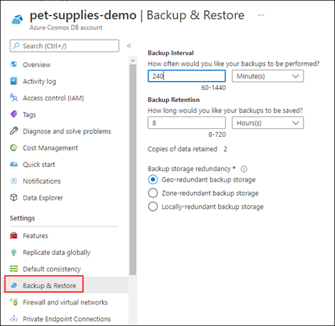
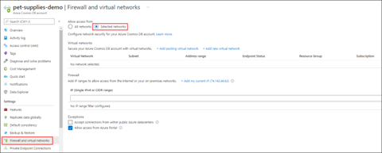

# Use Azure Cosmos DB for mission critical situations

Azure Cosmos DB is built for mission critical situations. In addition to being a replicable, globally distributed database system, it has other features that help in mission critical situations:

- Continuous backup and restore

- Secure access via firewalls, virtual networks, and private connections

- Secure data via customer managed keys and client-side encryption

## Continuous backup and restore

Azure Cosmos DB performs data backups without impacting the performance and availability of your databases. Also, it operates without consuming additional RUs. These backups are taken in every region where the account exists. These backups can be used for a point-in-time restoration within the retention period.

Retention periods are the lowest time value of these two situations:

- Up to resource creation time

- 30 days in the past

Continuous backups are stored in locally redundant storage blobs by default. However, if regions are set up to be zone redundant, then continuous backups are stored in zone redundant storage blobs.

These settings are configurable in the Azure portal, under the **Backup & Restore** setting for your Azure Cosmos DB account.

> Restoring always restores into a new account.

For more information about how to work with continuous backup and restore, see [Continuous backup with point-in-time restore in Azure Cosmos DB](https://docs.microsoft.com/azure/cosmos-db/continuous-backup-restore-introduction).

## Secure access to your Azure Cosmos DB account

Your Azure Cosmos DB account is publicly accessible by default and can be accessed whenever requests have valid authorization tokens. However, you can configure your Azure Cosmos DB account to be more secure.

When you view the resource in Azure portal, use these settings to secure your Cosmos DB account:

- Firewall and virtual networks

- Private Endpoint Connections

You can use firewall settings to allow connections from specific IP addresses and CIDR ranges. Note that IP addresses are in IPv4 notation. For more information, see [Configure IP firewall in Azure Cosmos DB](https://docs.microsoft.com/azure/cosmos-db/how-to-configure-firewall).

You can secure Azure Cosmos DB by placing it on a virtual network for access. Virtual network traffic accesses Azure Cosmos DB via a service endpoint. For more information, see [Configure access to Azure Cosmos DB from virtual networks](https://docs.microsoft.com/azure/cosmos-db/how-to-configure-vnet-service-endpoint).

Virtual networks that access Azure Cosmos DB work with Azure Private Link. It exposes a private endpoint to a subnet within your virtual network. For more information, see [Configure Azure Private Link for an Azure Cosmos account](https://docs.microsoft.com/azure/cosmos-db/how-to-configure-private-endpoints).

## Secure data via additional encryption

There are multiple ways to manage data access in Azure Cosmos DB: You can use multiple keys, read-only keys, and role-based access control. Data is also secured in other ways. By default, data stored in Azure Cosmos DB is encrypted with service-managed keys, which means you don't need to do anything to configure the first layer of encryption.

If service-managed keys aren't secure enough, you can use customer-managed keys as a second layer of data encryption. For more information, see [Configure customer-managed keys for your Azure Cosmos account with Azure Key Vault](https://docs.microsoft.com/azure/cosmos-db/how-to-setup-cmk).

Another Azure Cosmos DB data encryption feature is *Always Encrypted*. This feature supports client-side encryption. Use it when you transmit sensitive data, such as credit card numbers or personal identification numbers, such as national identification numbers. Always Encrypted allows you to set access controls at the property level for stored objects. For more information, see [Use client-side encryption with Always Encrypted for Azure Cosmos DB](https://docs.microsoft.com/azure/cosmos-db/how-to-always-encrypted?tabs=java).

[Next &#124; Migrate to Azure Spring Cloud](migrate-to-azure-spring-cloud.md){: .btn .btn-primary .btn-lg }
