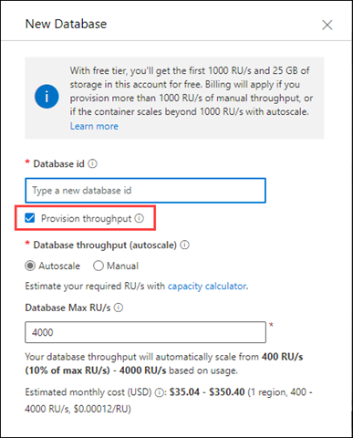
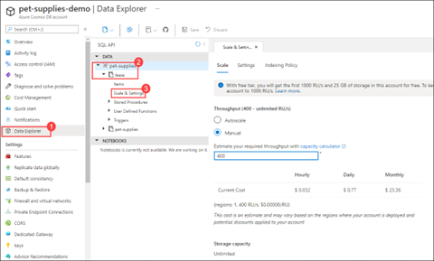

# Scaling in Azure Cosmos DB

*Azure Cosmos DB* offers *serverless* and *provisioned throughput* scaling. Serverless scalability works well with intermittent workloads. In the upcoming demo however we give you an example of provisioned throughput.

At the time that you create your database, you need to decide whether to use provisioned throughput or serverless scaling.

Serverless scalability is coupled with *Azure Functions* and other [Azure serverless](https://azure.microsoft.com/solutions/serverless/) solutions. With serverless, you pay on a per-hour basis rather than in RUs. Serverless accounts aren't geo-redundant, because they're limited to a single region.

With provisioned throughput, scale settings are configured at the container level. There are two options for scaling container throughput:

- Manual

- Autoscale

The **Manual** setting for scaling your containers gives you control to set the throughput of the container. This works best when you have a consistent, steady workload. When you configure a container for manual throughput, you need to set the desired throughput. In our example, we set scaling to 400 RUs and it consistently stays at 400 RUs. If the workload gets heavier, we need to adjust the setting manually.

The **Autoscale** setting works best in cases when traffic ebbs and flows. If you choose Autoscale for your container, you need to specify a maximum number of RUs for the resource. Your Azure Cosmos DB container can scale from 10% of max RUs to the max RUs.

## Learn more

- [How to choose between provisioned throughput and serverless on Azure Cosmos DB](https://docs.microsoft.com/azure/cosmos-db/throughput-serverless)

- [How to choose between manual and autoscale on Azure Cosmos DB](https://docs.microsoft.com/azure/cosmos-db/how-to-choose-offer)

[Next &#124; Bulk executor](bulk-executor.md){: .btn .btn-primary .btn-lg }
