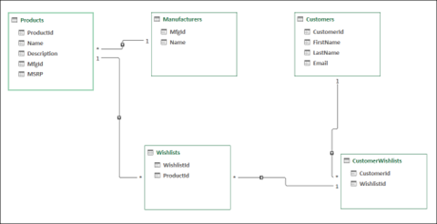
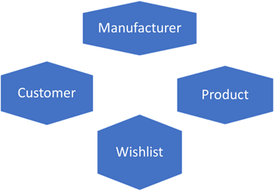

# Schema design considerations for Azure Cosmos database

Azure Cosmos DB stores data as schema-less JSON objects. The schema you intend to use needs to be managed or enforced by outside applications.

There are decisions in your Cosmos DB design that need to be made before you create the database. You need to consider the following when creating JSON objects:

- Data modeling

- Partition key

## Data modeling

Before you store data, make sure your objects are stored in a logical way.

In nonrelational databases, data is stored denormalized. They are optimized for queries and writes.

Consider the Contoso Pet Supplies models in a relational entity relationship diagram:

Notice that tables are organized by entities, and bridge tables establish the relationships between entities.

When we break this into documents for Cosmos DB, we need to consider the following:

- How is this data accessed?

- Are columns called together frequently in queries?

- Are columns called together frequently in queries via JOINs? Keep in mind that the relational concept of JOINs does not translate to the JOIN in Cosmos DB.

- Are columns updated together?

Sometimes entities translate 1-to-1 in relational to nonrelational. At other times you'll find that it makes more sense to embed entities. This can occur when you embed the manufacturer within a product. For example, if we don't use the manufacturer alone but use it only when we work with products. When you need to use JOINs in relational queries, you may need to denormalize the data. For example when you pass customer emails for wishlist notifications. That's because wishlist updates need to go to the customer.

This article gives guidance on [Modeling data in Cosmos DB](https://docs.microsoft.com/azure/cosmos-db/sql/modeling-data).

## Partition key decisions

The partition key stores objects of the same value together in the partition key. For example, if we want to categorize our products, we could store them in a separate container and partition them by category. This would store products of the same category together in a logical partition. When determining what to use for the partition key, keep this guidance in mind:

- For read-heavy containers, use a field that is optimized for frequently-run queries.
- For write-heavy containers, use a field with diverse data that balances the load.

When looking at models in the Contoso Pet Supplies project, we create a property called `documentType` to use as the partition key. A couple of exercises bring us to that decision:

- We first look at our data to see what details are stored in our objects. If they all have to live in one container, what would the queries look like? There would be many queries filtered by object type.

- We then view our data for how it loads in the database. The object type needs to be diverse enough to balance the load across partitions. It needs to ensure each value has a similar load and that no single value takes on a heavy load.

By setting `documentType` as our partition key, we have a key that works well for our environment.

## Additional References

- [Partition Strategy | Cosmos DB Essentials Season 2 (YouTube)](https://www.youtube.com/watch?v=QLgK8yhKd5U)

- [Schema Design Strategy | Cosmos DB Essentials Season 2 (YouTube)](https://www.youtube.com/watch?v=bKDaL-GRSAM)

[Next &#124; Cosmos DB for mission critical situations](mission-critical-situations-for-cosmos-db.md){: .btn .btn-primary .btn-lg }
