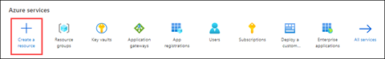
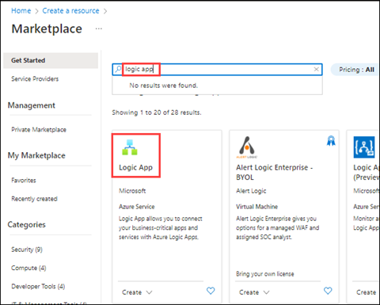
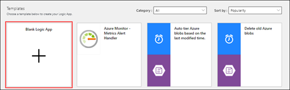
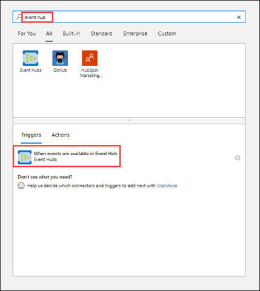

# Send notifications with Azure Logic Apps

In our sample, we want to notify someone when products are updated. We will use Azure Logic Apps to automate this process.

Azure Logic apps are used to handle automations that integrate systems, services, apps, and data. They work well in moving data around, sending notifications, monitoring data sources, and connecting with other services through connectors.

Examples of logic apps include:

- Sending email when an event happens

- Monitoring business reviews, analyzing the review contents, and sending notifications based on outcomes

- Data cleansing pipeline and data migration

- Integrating APIs and external systems

We are building this example from the chain we started with our Azure Cosmos DB triggered Azure Function. The Azure Function is sending data to Azure Event Hub. Our Logic App will monitor the Azure Event Hub notifications and email us when products are updated.

## Create a logic app

1. In the Azure portal, select **Create a resource.**

   

1. Search for **logic app**, then select **Logic App.**

   

1. Select **Create**.

1. On the **Create Logic App** screen, enter the following settings:

   - Resource Group: pet-supplies-demo-rg

   - Logic App name: pet-supplies-wishlist-notice

   - Publish: Workflow

   - Region: choose your region

   - Plan type: Consumption

1. Select **Review + Create**, then select **Create**.

## Building the logic app

1. Once the logic app is created, navigate to the resource. This will load
the Logic App Designer. Select **Blank Logic App**.

   

1. For the first task, search for event hub, then select the trigger **When
events are available in Event Hub**.

   

1. Give your connection a name. For **Connection String**, set it to the value
you used in AZURE_EVENT_HUB_CONNECTION. Then, select **Create**.

1. Once the step connects to the event hub, enter the following settings:

   - Event Hub name: pet-supplies-events

   - Content type: application/json

   - Consumer group name: $Default

1. Add a new step.

1. Search for **Send an Email (V2) Outlook**.

1. Sign in with your Office 365 credentials.

1. Put your email address in the .**To** list.

1. For the subject, use **Contoso Product Update**.

1. For the body, use: "The following product is updated:".

1. Add **Content** from the **Dynamic content** dialog.

1. Select **Save**.

1. Make some changes in the Pet Supplies products. These should add events to the event hub.

1. Select **Run Trigger**, then **Run**.

## Learn more

- [Overview for Azure Logic Apps - Azure Logic Apps](https://docs.microsoft.com/azure/logic-apps/logic-apps-overview)

- [Integration and automation platform options in Azure](https://docs.microsoft.com/azure/azure-functions/functions-compare-logic-apps-ms-flow-webjobs)

[Next &#124; Scaling in Azure Cosmos DB](scaling-in-cosmos-db.md){: .btn .btn-primary .btn-lg }
